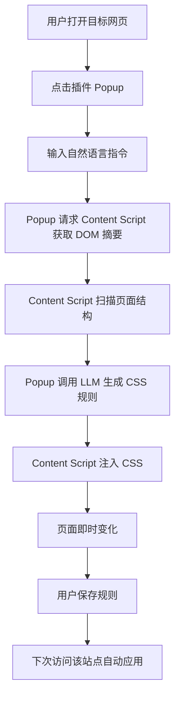

# CleanWeb

CleanWeb 是一个自然语言驱动的网页净化浏览器插件。用户打开一个信息很乱的网页后，只需要输入一句话，例如“隐藏右侧推荐和广告，把正文居中放大”，插件就会分析当前页面结构，生成并注入 CSS 规则，让页面立即变得更适合阅读。

这个项目当前按黑客松 MVP 推进，优先做出可以现场演示的完整闭环，而不是一开始做成复杂 SaaS。

## 项目定位

```text
臃肿网页 -> 输入自然语言 -> 生成 CSS 规则 -> 页面立即变清爽 -> 保存规则 -> 下次自动生效
```

核心目标：

- 用户不需要懂 CSS、油猴脚本或插件开发。
- 插件只做网页净化，不做复杂自动化操作。
- 黑客松阶段优先生成 CSS，不让 AI 生成或执行 JS。
- 规则按网站 hostname 保存，方便下次访问自动应用。

## 技术栈

- WXT
- Vue
- TypeScript
- Tailwind CSS v4
- Chrome Extension Manifest V3
- Content Script
- Browser Storage
- OpenAI / 兼容 OpenAI 的 LLM API

## MVP 范围

第一版只做最小可演示闭环：

1. Popup 输入自然语言指令。
2. Content Script 收集当前页面 DOM 摘要。
3. AI 根据指令和 DOM 摘要生成 CSS JSON。
4. Content Script 注入 CSS，页面立即变化。
5. 按 hostname 保存规则。
6. 刷新网页后自动应用已保存规则。
7. 一键恢复，移除注入样式并删除当前网站规则。

暂时不做：

- 登录系统
- 云端规则市场
- 多设备同步
- JS 脚本生成
- 完整 SaaS 控制台
- 可视化 DOM 编辑器

## 当前项目结构

```text
assets/
components/
entrypoints/
  background.ts
  popup/
    App.vue
    index.html
    main.ts
    style.css
  content.ts

types/
  cleanweb.ts

utils/
  dom-summary.ts
  llm.ts
  storage.ts

wxt.config.ts
package.json
tsconfig.json
public/
  icon/
```

当前结构对齐 WXT 官方 Vue 模板：保留 `assets`、`components`、`entrypoints`、`public` 这些顶层目录，把浏览器插件的入口统一放在 `entrypoints` 里。

## 当前已完成的骨架能力

- Popup 基础界面
- Popup 和 Content Script 消息通信
- Background Service Worker 占位入口
- 读取当前页面可见 DOM 摘要
- 注入测试 CSS
- 按 hostname 保存 CSS 规则
- 页面加载时自动应用已保存规则
- 一键恢复当前网站规则

现在还没有接入真实 AI。Popup 里的 CSS 是临时测试规则，用来先验证插件主流程。

## 核心数据流



## DOM 摘要设计

不要把完整 `document.body.innerHTML` 发给模型。原因是内容太长、隐私风险高、成本高，也容易让模型被无关网页内容干扰。

Content Script 应该只收集精简摘要：

```json
[
  {
    "selector": "#sidebar",
    "tag": "aside",
    "id": "sidebar",
    "className": "right-sidebar recommend-list",
    "role": "complementary",
    "ariaLabel": "推荐内容",
    "text": "推荐 关注 热榜",
    "rect": { "x": 0, "y": 80, "width": 260, "height": 820 },
    "visible": true
  }
]
```

当前实现最多取 80 个可见元素，并优先保留面积较大的元素。

## AI 输出格式

AI 只返回 JSON，不返回 Markdown，不生成 JS。

期望格式：

```json
{
  "css": ".sidebar, .ads { display: none !important; } .main { max-width: 900px; margin: 0 auto; }",
  "explanation": "隐藏侧边栏和广告，扩大正文区域"
}
```

Prompt 方向：

```text
你是浏览器插件的网页净化规则生成器。
只能返回 JSON。
只能生成 CSS。
不要生成 JS。
优先使用稳定选择器：id、aria-label、role、语义 class。
避免使用过深的 nth-child。
CSS 必须尽量只影响当前网页的干扰区域，不要全局破坏页面交互。
```

## 黑客松执行方案

### 第 1 阶段：插件骨架

目标：先让插件活起来。

- 初始化 WXT + Vue 项目
- 建立 Popup 页面
- 建立 Content Script
- 实现 Popup -> Content Script 消息通信
- 点击按钮注入测试 CSS
- 点击按钮恢复页面

验收标准：

```text
打开任意网页 -> 打开插件 -> 点击应用 -> 页面样式变化 -> 点击恢复 -> 页面恢复
```

### 第 2 阶段：规则保存

目标：让插件具备真实使用感。

- 以 hostname 为 key 保存 CSS 规则
- 页面加载时自动读取并应用规则
- 恢复时删除当前网站规则

验收标准：

```text
应用规则 -> 刷新网页 -> 规则仍然生效 -> 点击恢复 -> 刷新后不再生效
```

### 第 3 阶段：DOM 摘要

目标：让 AI 有足够信息生成 CSS。

- 收集 tagName、id、className、role、aria-label
- 收集 innerText 前 80 字
- 收集 boundingClientRect
- 过滤不可见元素和过小元素
- 限制元素数量，避免 prompt 过长

验收标准：

```text
Popup 点击读取页面 -> 能拿到当前页面主要区域的结构摘要
```

### 第 4 阶段：AI 生成 CSS

目标：把手写 CSS 换成 AI 生成规则。

- 设计稳定 prompt
- 接入 OpenAI 或兼容 API
- 要求模型返回结构化 JSON
- 校验 JSON 是否包含 css 字段
- 失败时使用 fallback 规则

验收标准：

```text
输入自然语言 -> AI 返回 CSS -> 点击应用 -> 页面按指令变化
```

### 第 5 阶段：Demo 打磨

目标：保证现场演示稳定。

- 准备 2 到 3 个固定 demo 网站
- 为每个 demo 网站准备一条自然语言指令
- 为每个 demo 网站准备 fallback CSS
- 录制一版备用演示视频
- 准备 3 分钟讲解脚本

推荐 demo 流程：

```text
1. 打开一个信息密度高的网站
2. 展示原始页面很乱
3. 打开 CleanWeb 插件
4. 输入：隐藏右侧推荐和广告，保留正文，把正文居中放大
5. 点击生成并应用
6. 页面立即变清爽
7. 点击保存或说明已保存
8. 刷新网页，规则自动生效
9. 点击恢复，原网页回来
```

## 分工建议

当前分工还未最终确定，可以先按模块拆。这个项目可以拆成 7 个模块：

| 模块 | 内容 | 难度 | 适合谁 |
| --- | --- | --- | --- |
| 插件主工程 | WXT 配置、入口组织、Popup/Content/Background 串联、构建发布 | 高 | 你 |
| Popup 交互 | 指令输入、规则预览、应用/保存/恢复状态、错误提示 | 中 | 你或偏前端的队友 |
| Content Script | 扫描 DOM、注入 CSS、恢复页面、监听页面变化 | 高 | 你或 JS 基础强的队友 |
| DOM 摘要 | 可见元素过滤、selector 生成、摘要压缩、隐私过滤 | 中高 | 逻辑能力强的队友 |
| AI 规则生成 | Prompt、API 接入、JSON 校验、fallback CSS | 中高 | 对 AI/API 熟的队友 |
| Storage 规则管理 | 按 hostname 保存、读取、删除、后续规则列表 | 中 | 任意前端队友 |
| Demo 与答辩 | 选网站、准备指令、备用 CSS、演示脚本、PPT | 中 | 沟通表达强的队友 |

如果你现在还不知道另外两个人会什么，建议先这样临时安排：

- 你先负责插件主工程、Popup、Content Script 的最小闭环。
- 队友 A 先负责 DOM 摘要，哪怕他不懂插件，也可以在普通网页控制台里调试 DOM 选择逻辑。
- 队友 B 先负责 AI prompt、API 调用和 demo 网站 fallback CSS，哪怕他不懂 WXT，也可以先写独立函数。

你的最佳负责模块：

```text
插件主工程 + Popup 交互 + 最终 Demo 闭环
```

原因：

- 你熟 Vue，Popup 本质就是一个小 Vue App。
- 你熟桌面端和前端工程，适合把多个入口和状态流串起来。
- 黑客松现场最怕主流程断，你负责主流程最稳。
- 浏览器插件经验可以边做边补，WXT 已经帮你屏蔽了很多 Manifest V3 细节。

不建议你一开始把 AI prompt 和 DOM 摘要全揽走。你应该先保证插件能跑，再把两个队友的模块接进来。

### 模块交付边界

插件主工程交付：

```text
Popup 能打开
Content Script 能注入 CSS
Background 能作为后续 API 中转入口
规则能保存和恢复
```

DOM 摘要交付：

```text
输入当前 document
输出最多 80 个结构化元素摘要
不包含完整 HTML
不包含大段隐私文本
```

AI 规则生成交付：

```text
输入用户指令 + DOM 摘要
输出 { css, explanation }
失败时返回 fallback CSS
```

Demo 交付：

```text
2-3 个固定网站
每个网站一条指令
每个网站一份备用 CSS
一份 3 分钟讲解脚本
```

原始模块拆分：

- 插件主流程：WXT、Popup、Content Script、消息通信、规则保存。
- DOM 摘要：页面扫描、选择器生成、元素过滤、摘要压缩。
- AI 规则生成：Prompt、API 接入、JSON 校验、fallback 规则。
- Demo 准备：测试网站、演示脚本、备用视频、展示材料。

如果三个人都参与 coding，推荐最终拆成：

```text
成员 1：插件主工程和演示闭环
成员 2：DOM 摘要和选择器稳定性
成员 3：AI 接入、prompt 和 demo 网站适配
```

## 本地开发

官方推荐初始化方式是：

```bash
npx wxt@latest init
```

然后选择 Vue 模板。当前仓库已经手动对齐了 WXT Vue 模板的主要结构。之前没有直接运行初始化命令，是因为当前环境没有联网安装依赖，而且直接运行初始化可能覆盖已有文件；所以先按官方结构创建了可控的项目骨架。

当前样式使用 Tailwind CSS v4。v4 不需要 `tailwind.config.ts`，主题变量直接写在 CSS 入口里：

```css
@import "tailwindcss";

@theme {
  --color-brand: #2e6f63;
}
```

AI 模块接口文档见：

```text
docs/ai-module-contract.md
```

Core 模块测试计划见：

```text
docs/core-test-plan.md
```

安装依赖：

```bash
npm install
```

启动开发：

```bash
npm run dev
```

如果 PowerShell 禁止直接运行 `npm`，可以使用：

```bash
npm.cmd install
npm.cmd run dev
```

然后按 WXT 的提示在 Chrome 中加载生成的扩展。

## 下一步

优先顺序：

1. 安装依赖并启动 WXT。
2. 在 Chrome 加载开发扩展。
3. 验证 Popup 能打开。
4. 验证“读取页面 / 应用并保存 / 恢复”三个按钮。
5. 接入 LLM，把测试 CSS 替换为 AI 生成 CSS。
