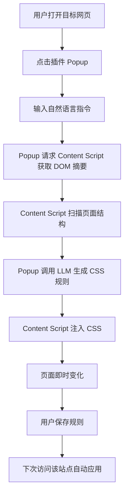

# CleanWeb

CleanWeb 是一个自然语言驱动的网页净化浏览器插件。用户输入一句话，例如“隐藏右侧推荐和广告，把正文居中放大”，插件分析页面结构，生成并注入 CSS 规则，让页面立即变得更适合阅读。

```text
臃肿网页 -> 输入自然语言 -> 生成 CSS 规则 -> 页面立即变清爽 -> 保存规则 -> 下次自动生效
```

## 工作原理



### 1. DOM 摘要采集

Content Script 扫描页面，收集最多 80 个可见元素的结构化摘要，而非完整 HTML：

- 过滤不可见元素（`display: none`、`visibility: hidden`、`opacity: 0`）
- 过滤面积小于 900px² 的元素
- 按面积从大到小排序，优先保留主要内容区域
- 每个元素包含：选择器、标签名、id、className、role、aria-label、文本摘要、位置尺寸

选择器生成优先使用稳定标识：`id` → `aria-label` → `role` → `class`，避免过深的层级选择器。

### 2. AI 生成 CSS

将用户指令与 DOM 摘要发送给 LLM，模型只返回 JSON 格式的 CSS 规则：

```json
{
  "css": ".sidebar, .ads { display: none !important; } .main { max-width: 900px; margin: 0 auto; }",
  "explanation": "隐藏侧边栏和广告，扩大正文区域"
}
```

设计原则：
- 只生成 CSS，不生成或执行 JS
- 使用稳定选择器，避免破坏页面交互
- CSS 规则尽量只影响干扰区域

### 3. 注入与持久化

Content Script 在页面头部创建单个 `<style>` 标签，注入生成的 CSS。规则按网站 hostname 保存到浏览器本地存储，下次访问自动应用。点击"恢复"按钮可移除注入样式并删除规则。

## 项目结构

```text
entrypoints/
  popup/App.vue          # 插件弹窗界面
  content.ts             # 页面脚本：DOM 扫描、CSS 注入
  background.ts          # 后台服务 Worker

utils/
  dom-summary.ts         # DOM 摘要采集与选择器生成
  storage.ts             # 规则存储（按 hostname）
  llm.ts                 # LLM 集成接口

types/cleanweb.ts        # 类型定义
```

## 技术栈

- WXT + Vue + TypeScript
- Tailwind CSS v4
- Chrome Extension Manifest V3
- OpenAI / 兼容 OpenAI 的 LLM API

## 本地开发

```bash
npm install
npm run dev
```

按 WXT 提示在 Chrome 中加载生成的扩展即可调试。
